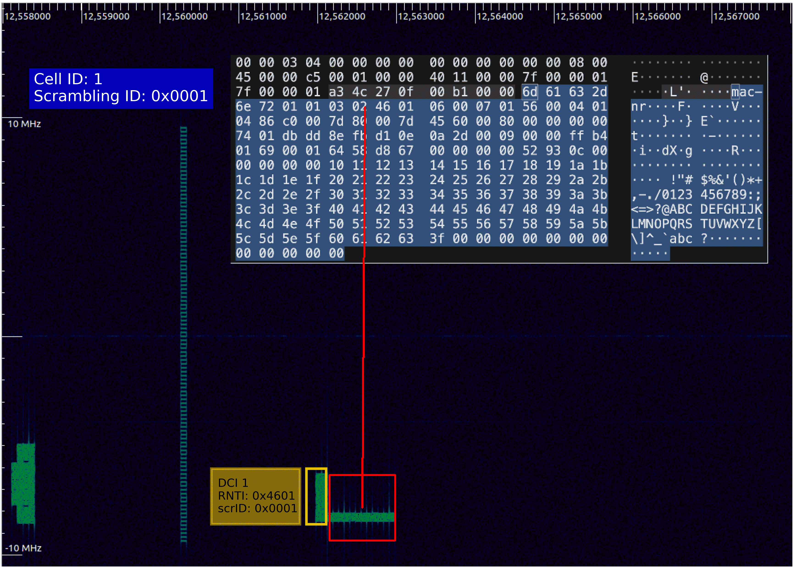

# Golden Sniffer - Low-Complexity 5G NR Signal Interception

[](https://www.mathworks.com/products/matlab.html)
[](https://www.3gpp.org/)
[](LICENSE)

**Golden Sniffer** is a novel, low-complexity passive 5G NR sniffer that exploits the deterministic nature of **Gold sequences** in DMRS (Demodulation Reference Signals) to achieve efficient blind detection and decoding of downlink control and data channels. Unlike traditional sniffers that perform exhaustive search, Golden Sniffer uses DMRS phase analysis to drastically reduce computational complexity while achieving >94% DCI detection rate.

## 🔬 Research Contributions

This tool implements breakthrough techniques for 5G NR passive monitoring:

1. **Power-Clustering PDCCH Search Space detection**: Only considers possible DCI candidates in correspondence of power clusters
1. **DMRS-Guided Blind Search**: Exploits the Gold Sequence generation rule to directly extract the PDCCH DM-RS scrambling ID
2. **Blind RNTI extraction thorugh Linear Inversion over GF(2)**: In the high-SNR limit, extract the RNTI and DCI message size through fast linear algebra over GF(2)
3. **Single layer PDSCH decoding with BWP and ZP-CSI-RS identification**: Validation of the PHY parameters through DL-SCH decoding

## 🎯 Key Features

- **Gold Sequence Exploitation**: Leverages deterministic DMRS generation to reduce blind search complexity
- **Intelligent DM-RS Scrambling ID Recovery**: Phase-based technique to extract 16-bit Scrambling ID from PDCCH DM-RS without exhaustive search
- **Robust Synchronization and Tracking**: Receiver frame processing does not require external time or frequency references
- **MIB/SIB1 Decoding**: Extraction of system information from broadcast channels
- **Smart DCI Detection**: Energy detection + phase verification to minimize false positives
- **PDSCH Decoding**: Data channel decoding with MAC PDU extraction into PCAP files
- **Multi-UE Tracking**: Seamless monitoring of multiple UEs
- **FDD/TDD Support**: Works with both frequency and time division duplexing modes

## 📊 Performance Results

Validated on **80+ real-world captures** from operational 5G networks (srsRAN, Open5GS):

| Scenario | DCI Detection Rate | DCI 0_0 (UL) | DCI 1_0 (DL) |
|----------|-------------------|--------------|--------------|
| **Single UE (FDD)** | **92.20% ± 3.09%** | ✓ | ✓ |
| **Multi UE (FDD)** | **97.22% ± 2.04%** | ✓ | ✓ |
| **Multi UE (TDD)** | **94.66% ± 1.92%** | ✓ | ✓ |
| **Network Slicing** | **98.52% ± 0.54%** | ✓ | ✓ |

### Complexity Analysis

**Traditional Exhaustive Search:**
- RNTIs to test: 65,536 (16-bit space)
- DCI sizes to test: ~22 (per RNTI)
- Total trials per CCE: **1,441,792**

**Golden Sniffer (DMRS-Guided):**
- Phase analysis identifies ~50 candidate RNTIs
- Only promising candidates decoded
- Total trials per CCE: **~3,364** (~96% reduction)

## 📦 Requirements

### MATLAB Toolboxes
- **5G Toolbox** (required)
- **Signal Processing Toolbox** (required)
- **Communications Toolbox** (required)

### Supported MATLAB Versions
- R2023a or later (recommended)
- R2025a or later (tested)

## 🚀 Quick Start

### Installation

```matlab
% Clone the repository and add to MATLAB path
cd 5G-GoldenSniffer
```

### Basic Usage

```matlab
% Run GoldenSniffer with sample configuration from the examples/ folder
addpath('examples');
example_basic
```

### Using Artifact Evaluation Dataset

```matlab
% download the dataset from https://doi.org/10.5281/zenodo.21678295 into the captures/ folder
addpath('examples')
example_iq(id) % with id = 1:25 

```

## 📡 Supported Input Formats

| Format | Extension | Description |
|--------|-----------|-------------|
| Float32 Complex | `.fc32` | I/Q samples as 32-bit floats |
| Int16 Complex | `.sc16` | I/Q samples as 16-bit integers |

### Creating Captures

Use GNU Radio, USRP UHD, or similar tools:

```bash
# Using uhd_rx_cfile (USRP)
uhd_rx_cfile -f 1970e6 -r 15.36e6 --type=float32 capture.fc32

# Using GNU Radio (example flowgraph output)
# Configure UHD source → File Sink
```

## 🔧 Configuration Parameters

### Main Parameters

GoldenSniffer needs a struct `config` argument with the following fields:

```matlab
  config.dir = 'captures'
  config.filename = 'capture.{fc32,sc16}';
      will open the raw I/Q sample capture file config.filename in the folder
      config.dir; interleaved complex float32 (fc32) or int16 (sc16) formats 
      are supported

  config.carrier_frequency_MHz = 1980;
  config.frequency_offset_MHz = 0;
  config.bandwidth_MHz = 20;
  config.sample_rate_MHz = 23.04;
      specify the carrier frequency, a possible frequency offset with
      respect to the acquisition center frequency, the carrier bandwidth
      and the sampling rate, in MHz

  config.nzpCSI_known = false;
  config.search_unknown_nzpCSI = true;
  config.zpCSI_known = false;
      specify the parameters of the noCDM NZP-CSI-RS (density 3 and
      density 1) and ZP-CSI-RS (4RE x 1symbol), whose knowledge is
      necessary for successful PDSCH decoding of slots containing the
      CSI-RS
      if the _known variables are set to false and the
      search_unknown_nzpCSI is true, the execution will pause when a
      valid configuration is found, so that the config variable can be
      updated for faster future runs
```

### Visualization

The configuration field `FIGURES` contains a bitmap:

1. `0x0001`: time-frequency map for PSS acquisition
2. `0x0002`: cyclic prefix autocorrelation (to check PSS time alignment)
3. `0x0004`: features of the Timing Error Detector
4. `0x0008`: SS-block based channel estimates (to check frequency alignment)
5. `0x0010`: CFO and timing error log wrt Frame-number
6. `0x0020`: PBCH-based channel estimates
7. `0x0040`: synchronized frame, with a green highlight on the successfully decoded channels
8. `0x0080`: NZP-CSI-RS based channel estimation
9. `0x0100`: features of the power clustering used for blind PDCCH detection
10. `0x0200`: PDCCH equalized constellations (QPSK)
11. `0x0400`: PDSCH equalized constellations (QPSK/16-QAM/64-QAM)

## 📖 Technical Details

### Gold Sequence Exploitation in 5G NR

The breakthrough of Golden Sniffer lies in exploiting the **deterministic properties of Gold sequences** used in 5G NR DMRS:

#### DMRS Scrambling Initialization
```
c_init = (2^17 · (N_symb · n_slot + l + 1) · (2 · N_ID + 1) + 2 · N_ID) mod 2^31
```

For PDCCH DMRS:
- **N_ID** (16 bits): The scrambling ID occupies the lowest 17 bits (with the last one set to 0) of c_init
- This creates a deterministic phase relationship observable in DMRS symbols

#### Phase Unwrapping Technique

Golden Sniffer uses **QPSK phase unwrapping** on DMRS symbols to extract candidate RNTIs:

1. **DMRS Extraction**: Extract DMRS resource elements from PDCCH candidates
2. **Phase Analysis**: Compute phase differences correlated with RNTI bits
3. **RNTI Candidates**: Generate short-list of ~50 candidate RNTIs (vs. 65,536)
4. **Verification**: Only decode DCI for promising candidates

This reduces computational complexity from **O(65,536 × 22)** to **O(50 × 22)** per CCE.

### Sniffer Architecture

```
┌─────────────────┐
│  IQ Samples     │
│  (.fc32/.sc16)  │
└────────┬────────┘
         │
         ▼
┌─────────────────────────────────────┐
│  STEP 1: Synchronization            │
│  • PSS/SSS detection                │
│  • SSB blind search (GSCN grid)     │
│  • MIB decoding → System BW, SCS    │
│  • SIB1 decoding → CORESET config   │
└────────┬────────────────────────────┘
         │
         ▼
┌─────────────────────────────────────┐
│  STEP 2: BWP Discovery              │
│  • Search space monitoring          │
│  • CORESET resource mapping         │
│  • Aggregation level detection      │
└────────┬────────────────────────────┘
         │
         ▼
┌─────────────────────────────────────┐
│  STEP 3: PDCCH Blind Decoding       │
│  • Energy detection (candidates)    │
│  • DMRS phase unwrap → NID filter   │ ◄── GOLD SEQUENCE EXPLOIT
│  • Polar decoding (reduced trials)  │
│    + CRC-24C verification           │
└────────┬────────────────────────────┘
         │
         ▼
┌─────────────────────────────────────┐
│  STEP 4: PDSCH Decoding             │
│  • Resource allocation from DCI     │
│  • Channel estimation (DMRS)        │
│  • LDPC decoding                    │
│  • TB CRC verification              │
│  • MAC PDU extraction → PCAP        │
└─────────────────────────────────────┘
```

### 5G NR Standards Compliance

Golden Sniffer implements algorithms based on 3GPP specifications:

- **TS 38.211**: Physical channels and modulation (DMRS, PDCCH, PDSCH)
- **TS 38.212**: Channel coding (Polar codes for DCI, LDPC for data)
- **TS 38.213**: Control procedures (CORESET, search space, DCI formats)
- **TS 38.214**: Data procedures (resource allocation, MCS tables)
- **TS 38.331**: RRC protocol (MIB, SIB1 message formats)

### Supported DCI Formats

Golden Sniffer currently supports the most common DCI formats:

| Format | Direction | Description | Typical Use Case |
|--------|-----------|-------------|------------------|
| **DCI 0_0** | Uplink | PUSCH scheduling grant | UL data transmission |
| **DCI 1_0** | Downlink | PDSCH scheduling grant | DL data transmission |

Both formats support:
- Frequency domain resource allocation (Type 0 and Type 1)
- Time domain resource allocation  
- MCS and transport block size indication
- HARQ process number tracking
- NDI (New Data Indicator) for retransmissions

## 📈 Output Examples

### Console Output

```
========== GOLDEN SNIFFER TIMING ANALYSIS ===============
STEP 1 (Acquisition & Tracking):                996.99 ms (0.7%)
STEP 2 (FFT):                                  3936.80 ms (2.9%)
STEP 3 (blind PDCCH detection):               14284.85 ms (10.6%)
STEP 4 (CSI-RS, PDSCH format detect/decode):  67389.57 ms (50.1%)
OTHER PROCESSING / OVERHEAD                   47781.38 ms (35.6%)
TOTAL PROCESSING TIME:                       134389.60 ms
=========================================================
SFN range: 808:906

                     RNTI: 0x4601 0xffff
  Format1_0 with CRC pass:    990      6
  Format1_0 with CRC fail:      0      0
  FormatX_X (unconfirmed):    112      0
```

### PCAP Output

Decoded MAC PDUs are exported to **PCAP format** for analysis with Wireshark:

- **MAC-NR** layer dissection  
- Transport block visualization
- RLC/PDCP layer analysis (if unencrypted)
- Compatible with standard Wireshark 5G NR dissectors

#### Example: Controlled Testbed ICMP Packet Recovery

The figure below shows an ICMP Echo Reply packet (highlighted in Wireshark) successfully recovered by Golden Sniffer from PDSCH transmissions in a controlled testbed environment with encryption disabled. This demonstrates the sniffer's capability to decode data channel transmissions and extract higher-layer protocol information when encryption is not enabled.



**Figure: ICMP Echo Reply packet recovered from PDSCH**  
The Wireshark capture shows the decoded MAC-NR layer with the ICMP Echo Reply packet visible in the packet details pane. This validates Golden Sniffer's end-to-end decoding pipeline from physical layer (PDSCH) to application layer protocols.

**Testbed Configuration:**
- Environment: Controlled 5G NR testbed
- Base Station: srsRAN gNB
- UE: Commercial COTS device
- Security: Encryption disabled for testing
- Protocol: ICMP Echo Request/Reply (ping)

## 🔬 Validation & Testing

### Test Environment

Golden Sniffer has been extensively validated with:

**Software-Defined Radio Networks:**
- **srsRAN 4G/5G** (open-source RAN implementation)
- **Open5GS** core network
- Commercial UEs and custom COTS UEs

**Commercial 5G Networks:**
- Captures from multiple operators in various bands (n78, n28)

**Hardware:**
- **USRP B210/N310/X310** for signal capture

**Channel Conditions:**
- **LOS** (Line-of-Sight) and **NLOS** (Non-Line-of-Sight)
- **CDL channel models** (Cluster Delay Line - TS 38.901)
- **SNR range**: -5 dB to 25 dB
- **Fading scenarios**: TDL-A, TDL-C, CDL-C

### Supported Scenarios

✅ **Single UE**
✅ **Multi UE**  
✅ **Network Slicing** (multiple BWPs)
✅ **Different bandwidths** (5, 10, 20, 50, 100 MHz)
✅ **Non-interleaved and interleaved DCI's**
❌ **Encrypted traffic** (MAC layer decoding only)

## 🎓 Research Applications

Golden Sniffer enables various research domains:

### Network Security & Privacy
- Detection of IMSI catchers and rogue base stations
- Analysis of 5G security mechanisms
- Radio resource allocation fairness studies

### QoS & RRM Analysis  
- Resource block allocation monitoring
- Scheduler behavior analysis
- Network slicing resource distribution
- Latency and throughput characterization

### Protocol Validation
- gNB implementation compliance testing
- DCI format usage patterns
- HARQ retransmission analysis

### Spectrum Monitoring
- Interference detection and analysis
- Spectrum occupancy measurements
- Coexistence studies (LTE-NR, NR-NR)

## 🤝 Contributing

Contributions are welcome! We encourage:

- **Algorithm improvements** (e.g., support for Non-Fallback DCI formats 0_1, 1_1)
- **New channel models** and propagation scenarios
- **Performance optimizations** for real-time processing
- **Documentation** and tutorial improvements

### Development Setup

1. Clone the repository
2. Add the samples scripts forlder to the search path `addpath('examples/')`
3. Validate installation: Run `example_basic.m`
4. Contribute!

## 📚 Citation

If you use Golden Sniffer in your research, please cite our work:

```bibtex
@inproceedings{goldensniffer2025,
  title = {{Golden Sniffer: Low-Complexity 5G New Radio Signal Interception Exploiting Gold Sequences.}},
  author = {Palamà, Ivan and Mangione, Stefano and Dino, Alessandra and Focarelli, Giulia and Bianchi, Giuseppe},
  booktitle={Proceedings of the 32nd Annual International Conference on Mobile Computing and Networking (MobiCom '26)},
  year={2026},
}
```

## 🙏 Acknowledgments

- The MathWorks for the 5G Toolbox
- 3GPP for the 5G NR specifications
- The open-source 5G community

## 📄 License

### Project Code
The original Golden Sniffer code and algorithms are released under the MIT License. See [LICENSE](LICENSE) file for details.

### MathWorks-Derived Code
Several functions in the `lib/` directory are derived from or based on MathWorks MATLAB 5G Toolbox examples and retain their original MathWorks copyright.

### Requirements
- Valid MATLAB license (R2023a or later)
- 5G Toolbox license
- Signal Processing Toolbox license
- Communications Toolbox license

## ⚠️ Disclaimer

This tool is intended for **research and educational purposes only**. Users are responsible for ensuring compliance with local laws and regulations regarding radio frequency monitoring and cellular network analysis.

---

**Note**: This is a research tool and may not work with all 5G NR deployments. Commercial networks may use configurations or features not currently supported.
